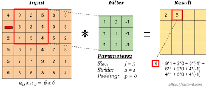
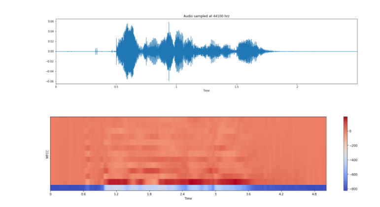

<h2>Speech Emotion Detection 🎤</h2>
<h3>Table of Content</h3>
<ul>
<li><a href='#intro'>Introduction</a></li>
<li><a href='#cnn'>Understanding CNN</a></li>
<li><a href='#voiceFeature'>Feature Engineering for Voice Data</a></li>
<li><a href='#'>Model creation and Evaluation</a></li>
<li><a href='#'>Prediction</a></li>
<li><a href='#'>Conclusion</a></li>
<li><a href='#credits'>Credits</a></li>
</ul>
<h3 id='intro'>Introduction</h3>

In today’s world often we encounter the need for speech emotion recognition such as in
customer relationship management (CRM), tele-calling system, and sales management.
We found that sometime recognizing the speech is required to get the intent of customers
those help companies to response accordingly.
In this project we are going to develop a deep learning model that will used to predict the
the emotion of different speech. For this purpose we are going to take the help of the 3 most popular datasets i.e. RAVDESS, TESS and SAVEE. There are several types of speech emotions that is already available in these datasets such as ‘Anger’, ‘Disgust’, ‘Fear’, ‘Happiness’,‘Sadness’, ‘Surprise’ and ‘Neutral’. To create the model we first need to convert speech into a mathematical feature so that we can able to compute the equation. There are several features that can be extracted from the
speech and from all these features we are going to use MFCC as our spatial feature because from this feature itself we can able to detect the human voice that is what we require. To create the model we are going to use CNN network architecture such as Conv1D or
Conv2D network and check the different level of accuracy of the model and choose the best
the architecture according to the accuracy itself.
We also uses different kinds of data augmentation technique that can be applied into the datasets to increase its size which then is used to improve the accuracy of the model.

<h3 id='cnn'>Understanding CNN</h3>

It stands for <i>Convolution Neural Network</i>, and it is the best algorithm when it comes to working with images, basically it takes two major mathematical processes that differentiate it with other Neural Network techniques.

<ol>
<li>Convolution Opration</li>
<li>Pooling Opration</li>
</ol>

1. <b>Convolution Opration</b>: Convolution is a specialized kind of linear operation. Convolution between two functions in mathematics produces a third function expressing how the shape of one function is modified by the other.
<h4>Convolution Kernels</h4>
A kernel is a small 2D matrix whose contents are based upon the operations to be performed. A kernel maps on the input image by simple matrix multiplication and addition, the output obtained is of lower dimensions and therefore easier to work with.

<b>Fig:</b> Convolution opration

In this figure we found that our input matrix is of 6x6 and filter is of size 3x3 with <i>stride</i> = 1 and <i>padding</i> = 0, <b>*</b> represents convolution operation between Input matrix and the filter. This filter is basically used to detect the vertical edge in the image i.e. resultant matrix is basically used to reduced the image width and only take those part which is important.

<h4>Pooling Operation</h4>

Its function is to progressively reduce the spatial size of the representation to reduce the amount of parameters and computation in the network. We uses pooling to recognize an image if the image is tilted or not the same as the previous image.

There are basically 2 types of pooling opraration:
<ol>
<li>Max Pooling</li>
<li>Average Pooling</li>
</ol>

<b>1. Max Pooling:</b>   

<b>Fig:</b> Max pooling Opration 

As the figure indicates if a 2x2 Max pool is used in the network then the  matrix creates a 2x2 window and takes the <i>maximum value among the 4 values</i> in that particular window. It's a very important operation in CNN because it's basically removes those low parameter values and reduces computation.

<b>2. Average pooling:</b> Average pooling is also doing a similar operation but instead of taking the maximum value from the window it calculates the average of the window and then gives the result. Basically today's in general we are using max-pooling as the pooling layer operation because it gives better accuracy and also it's a little faster than the average pooling opratin

With this two operation in CNN we can able to compute 2D inputs such as images very easily.

<h4>Complete CNN architecture</h4>

<b>Fig:</b> CNN Architecture

Let me explain the steps involved in this architecture

<ul>
<li>In the first step an image is passed to Conv layer 1 which is used to do convolution operation</li>
<li>Then pooling layer is created to reduced parameters</li>
<li>Layer 3 and 4 are similar like 1 and 2</li>
<li>In layer 5 which termed as hidden in this image also called flatten on fully connected layer are just a dense layer converted from the last conv layer after this layer only we apply <b>sigmoid or softmax</b> activation funtion to get the output.</li> </ul>
<h4>Introduction to datasets:</h4>

In this project we are using the three most popular datasets to train our model. Let’s get
some detailed information about these datasets.

<ol>
<li><b>SAVEE Datasets:</b></li> It stands for “Surrey Audio-Visual Expressed Emotion”. The SAVEE database was recorded from four native English male speakers (identified as DC, JE, JK, KL), postgraduate students and researchers at the University of Surrey aged from 27 to 31
years. Emotion has been described psychologically in discrete categories: anger,
disgust, fear, happiness, sadness and surprise. A neutral category is also added to
provide recordings of 7 emotion categories.
The text material consisted of 15 TIMIT sentences per emotion: 3 common, 2
emotion-specific and 10 generic sentences that were different for each emotion and
phonetically-balanced. The 3 common and 2 × 6 = 12 emotion-specific sentences
were recorded as neutral to give 30 neutral sentences. This resulted in a total of 120
utterances per speaker.</li>
<li><b>RAVDES Datasets:</b> It stands for “Ryerson Audio-Visual Database of Emotional Speech and Song”. Speech audio-only files (16bit, 48kHz.wav) from the RAVDESS. The portion that we are going to use in our project for the RAVDESS contains 1440
files: 60 trials per actor x 24 actors = 1440. The RAVDESS contains 24 professional actors (12 female, 12 male), vocalizing two lexically-matched statements in a neutral
North American accent. Speech emotions includes calm, happy, sad, angry, fearful,
surprise, and disgust expressions. Each expression is produced at two levels of
emotional intensity (normal, strong), with an additional neutral expression.
File naming convention
Each of the 1440 files has a unique filename. The filename consists of a 7-part
numerical identifier (e.g., 03-01-06-01-02-01-12.wav). These identifiers define the
stimulus characteristics:
Filename identifiers
<ul>
<li>Modality (01 = full-AV, 02 = video-only, 03 = audio-only).</li>
<li>Vocal channel (01 = speech, 02 = song).</li>
<li>Emotion (01 = neutral, 02 = calm, 03 = happy, 04 = sad, 05 = angry, 06 = fearful,
07 = disgust, 08 = surprised).</li>
<li>Emotional intensity (01 = normal, 02 = strong). NOTE: There is no strong intensity
for the 'neutral' emotion.</li>
<li>Statement (01 = "Kids are talking by the door", 02 = "Dogs are sitting by the door").</li>
<li>Repetition (01 = 1st repetition, 02 = 2nd repetition).</li>
<li>Actor (01 to 24. Odd-numbered actors are male, even-numbered actors are
female).</li></ul>

Filename example: 03-01-06-01-02-01-12.wav
Here is how it is describe:
<ol>
<li>Audio-only (03)</li>
<li>Speech (01)</li>
<li>Fearful (06)</li>
<li>Normal intensity (01)</li>
<li>Statement "dogs" (02)</li>
<li>1st Repetition (01)</li>
<li>12th Actor (12) ; Female, as the actor ID number is even.4 </li></ol></li>
<li><b>TESS Datasets:</b>

It stands for “Toronto emotional speech datasets”. There are a set of 200 target
words were spoken in the carrier phrase "Say the word by two actresses (aged
26 and 64 years) and recordings were made of the set portraying each of seven
emotions (anger, disgust, fear, happiness, pleasant surprise, sadness, and
neutral). There are 2800 data points (audio files) in total. The dataset is
organized such that each of the two female actors and their emotions are contain
within its own folder. And within that, all 200 target words audio file can be
found. The format of the audio file is a WAV format
The Emotions are basically divided like the following

<ul>
<li>female_surprise 400</li>
<li>female_happy 400</li>
<li>female_angry 400</li>
<li>female_fear 400</li>
<li>female_disgust 400</li>
<li>female_sad 400</li></ul>

<b>So, we are working on these datasets to train our model.
Combining our datasets together to form a single dataset:
To work efficiently we need to combine all of the three datasets  in a single
data frame.</b>
</ol>

<h3 id='voiceFeature'>Feature Engineering for Voice Data</h3>
In the previous section we discusses about all the different datasets and speech that we merged together and created a data frame. The data frame consist for a path for a file having speech(.wav) data. But this kind of data
is called unstructured data and we cannot able to work computationally that's why we need to extract some features that help us to build the model. There are lots of features which we can get from an audio data such as:

<ul>
<li>Spectral Centroid</li>
<li>Zero Crossing Rate</li>
<li>Chroma Frequencies</li>
<li>Mel Frequency Ceptral Coefficient(MFCC)</li></ul>

We are going to choose the MFCC feature because for human voice characterization and modeling "MFCC" is the best feature.

<h4>Extracting MFCC using Python:</h4>

we are using the librosa package which is one of the popular package available for speech
data analysis and preparation.

Let’s see one example:

To set the path we first take a string of complete path for one example:

<i>path = "/kaggle/input/ravdess-emotional-speech-audio/audio_speech_actors_01-24/Actor_11/03-01-
03-01-02-02-11.wav"</i>

Then to load speech we are using <b>“librosa.load( )”</b> method to load the audio data and extract
audio feature and sampling rate

<i>X, sample_rate = librosa.load(path, res_type='kaiser_fast',duration=2.5,sr=22050*2,offset=0.5)</i>

Now using <b>“librosa.feature.mfcc( )”</b> we can able to extract mfcc feature that we are going to
store in mfcc variable

mfcc = librosa.feature.mfcc(y=X, sr=sample_rate, n_mfcc=13)

<b>Plotting MFCC feature using Spectrogram</b>

In the above image we can see two images first one is called wave plot that indicates the voice transmission over time and another one is called spectrogram which is like a heatmap and here we used to plot MFCC over time. Here red color indicate high intensity and blue indicates low intensity.

Now we are using this feature in our model building and training

<h3 id='credits'>Credits:</h3> 

My spacial thanks goes to <b>Eu Jin Lok</b> who is a Kaggle grandmaster, whose notebook helped me to understand how to work with the speech dataset. From his notebook itself, I can able to understand various features and data augmentation techniques involved in speech data.

