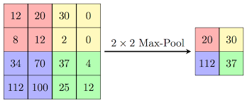

<h2>Speech Emotion Detection 🎤</h2>
<h3>Table of Content</h3>
<ul>
<li><a href='#'>Introduction</a></li>
<li><a href='#'>Understanding CNN</a></li>
<li><a href='#voiceFeature'>Feature Engineering for Voice Data</a></li>
<li><a href='#'>Model creation and Evaluation</a></li>
<li><a href='#'>Prediction</a></li>
<li><a href='#'>Conclusion</a></li>
<li><a href='#'>Credits</a></li>
</ul>
<h3 id='intro'>Introduction</h3>

In today’s world often we encounter the need for speech emotion recognition such as in
customer relationship management (CRM), tele-calling system, and sales management.
We found that sometime recognizing the speech is required to get the intent of customers
that help companies to response accordingly.
In this project we are going to develop a deep learning model that will used to predict the
emotion of different speech. For this purpose we are going to take help of 3 most popular datasets i.e. RAVDESS, TESS and SAVEE. There are several types of speech emotions that is already available in these datasets such as ‘Anger’, ‘Disgust’, ‘Fear’, ‘Happiness’,‘Sadness’, ‘Surprise’ and ‘Neutral’. To create the model we first need to convert speech into mathematical feature so that we can able to compute the equation. There are several features that can be extracted from the
speech and from all these features we are going to use MFCC as our spatial feature because from this feature itself we can able to detect the human voice that is what we require. To create the model we are going to use CNN network architecture such as Conv1D or
Conv2D network and check different level of accuracy of the model and choose the best
architecture according to the accuracy itself.
We also uses different kinds of data augmentation technique that can be applied into the datasets to increase its size which then is used to improve the accuracy of the model.

<h3 id='cnn'>Understanding CNN</h3>

It stands for <i>Convolution Neural Network</i>, and it is the best algorithm when it comes to working with images, basically it takes two major mathematical opration that diffrentiate it with other Neural Network techniques.

<ol>
<li>Convolution Opration</li>
<li>Pooling Opration</li>
</ol>

1. <b>Convolution Opration</b>: Convolution is a specialized kind of linear operation. Convolution between two functions in mathematics produces a third function expressing how the shape of one function is modified by other.
<h4>Convolution Kernels</h4>
A kernel is a small 2D matrix whose contents are based upon the operations to be performed. A kernel maps on the input image by simple matrix multiplication and addition, the output obtained is of lower dimensions and therefore easier to work with.

<b>Fig:</b> Convolution opration

In this figure we found that our input matrix is of 6x6 and filter is of size 3x3 with <i>stride</i> = 1 and <i>padding</i> = 0, <b>*</b> represents convolution operation between Input matrix and the filter. This filter is basically used to detect the vertical edge in the image i.e. resultant matrix is basically used to reduced the image width and only take those part which is important.

<h4>Pooling Operation</h4>

Its function is to progressively reduce the spatial size of the representation to reduce the amount of parameters and computation in the network. We uses pooling to recognize an image, if the image is tilted or not same as previous image.

There are basically 2 types of pooling opraration:
<ol>
<li>Max Pooling</li>
<li>Average Pooling</li>
</ol>

<b>1. Max Pooling:</b>   

<b>Fig:</b> Max pooling Opration 

As the figure indicates if a 2x2 Max pool is used in the network then the  matrix creates a 2x2 window and takes the <i>maximum value amoung the 4 values</i> in that particular window. It's very important opration in CNN because it's bascally removes those low parameter values and reduces computation.

<b>2. Average pooling:</b> Average pooling is also doing similar opration but instead of taking maximum value from the window it calculates the average of the window and then gives the result. Basically today's in general we are using max pooling as the pooling layer opration because it gives better accuracy and also it's little faster than the average pooling opratin

With this two operation in CNN we can able to compute 2D inputs such as images very easily.

<h4>Complete CNN architecture</h4>

<b>Fig:</b> CNN Architecture

Let me explain the steps involved in this architecture

<ul>
<li>In first step an images is passed to Conv layer 1 which is used to do convolutin operation</li>
<li>Then pooling layer is created to reduced parameters</li>
<li>Layer 3 and 4 are similar like 1 and 2</li>
<li>In layer 5 which termed as hidden in this image also called flatten on fully connected layer are just a dense layer converted from the last conv layer after this layer only we apply <b>sigmoid or softmax</b> activation funtion to get the output.</li> </ul>

<h3 id='voiceFeature'>
